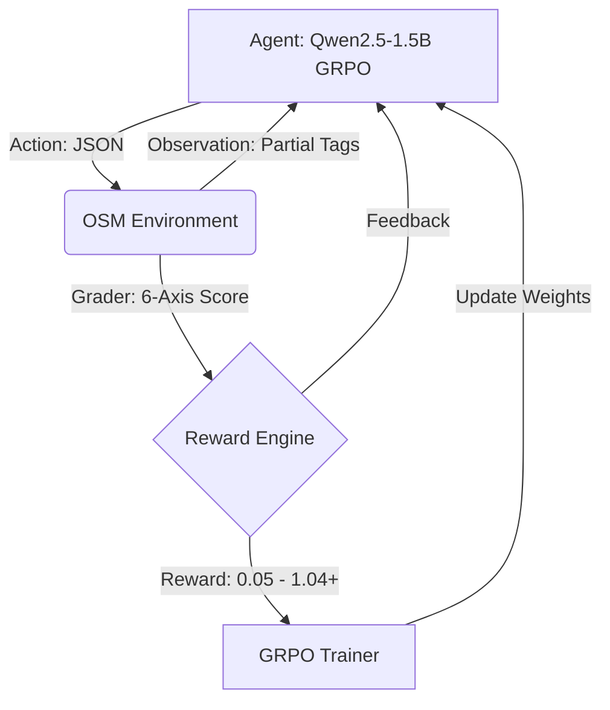

# OSM Map Quality Environment

[](https://github.com/Arawn-D/osm-map-quality-env)
[](https://huggingface.co/spaces/Arawn-1/osm-env)
[](https://huggingface.co/Arawn-1/osm-map-quality-agent)
[](https://github.com/Arawn-D/osm-map-quality-env)
[](https://arawn-1-osm-env.hf.space/health)

**A world-modeling RL environment for geographic data quality assurance.**

Train AI agents to reason under partial observability, resolve conflicting OSM data, and fix real-world map errors across three task tiers.

---

## What This Is

This is not a static RL benchmark. It is a **live world model** — a FastAPI server that simulates OpenStreetMap node editing with:

- Partial observability (tags revealed progressively through actions)
- Noise injection (typos, conflicting values, stale data) on every `/reset`
- Cascading error discovery (fixing coordinates may reveal address inconsistencies)
- Confidence calibration (overconfident wrong actions are penalized)
- A 6-axis grader scoring completeness, consistency, efficiency, accuracy, merge quality, and action sequence order

The agent calls this server over HTTP during GRPO training rollouts.

---

## Architecture

```
Agent (Qwen2.5-1.5B + LoRA + GRPO)
    |
    v
POST /reset  -->  Partial OSM Observation
POST /step   -->  Reward + Updated Observation
POST /grader -->  6-Axis Score (0.05 - 0.95)
```



---

## Environment Tasks

| Task | Difficulty | Issues | Max Steps | Key Challenge |
|---|---|---|---|---|
| `task_easy` | Easy | 1 | 10 | Identify POI type, set a valid name tag |
| `task_medium` | Medium | 4 | 20 | Complete all address fields; handle conflicting data |
| `task_hard` | Hard | 6 | 30 | Fix invalid coordinates, resolve duplicate, correct action sequence |

---

## Training

| Parameter | Value |
|---|---|
| Base model | `unsloth/qwen2.5-1.5b-instruct-unsloth-bnb-4bit` |
| Adapter | LoRA r=32, alpha=32, attention + MLP targets |
| Algorithm | GRPO (TRL + Unsloth) |
| Max sequence length | 768 tokens |
| Max completion length | 72 tokens |
| Training steps | 50 |
| Best checkpoint | checkpoint-50 |
| Early mean reward | ~0.97 |
| Final mean reward | ~1.04 |

The reward exceeding 1.0 is by design: positional bonuses and an EOS completion bonus stack on top of the base grader score when the agent follows the correct action sequence.

---

## API Interface

```bash
# Start a new episode
curl -X POST https://arawn-1-osm-env.hf.space/reset \
  -H 'Content-Type: application/json' \
  -d '{"task_id": "task_hard"}'

# Fix invalid coordinates
curl -X POST https://arawn-1-osm-env.hf.space/step \
  -H 'Content-Type: application/json' \
  -d '{"action_type": "fix_coordinates", "coordinates": {"lat": 17.4449, "lon": 78.5011}, "confidence": 0.9}'

# Set a tag
curl -X POST https://arawn-1-osm-env.hf.space/step \
  -H 'Content-Type: application/json' \
  -d '{"action_type": "set_tag", "tag_key": "name", "tag_value": "Yashoda Hospital", "confidence": 0.9}'

# Get episode score
curl -X POST https://arawn-1-osm-env.hf.space/grader \
  -H 'Content-Type: application/json' \
  -d '{"task_id": "task_hard"}'

# Check version
curl https://arawn-1-osm-env.hf.space/health
```

### Valid Action Types

| Action | Description |
|---|---|
| `set_tag` | Set a key-value tag on the node |
| `remove_tag` | Remove a tag |
| `fix_coordinates` | Set corrected lat/lon |
| `merge_duplicate` | Resolve a duplicate node |
| `flag_invalid` | Mark node as invalid |
| `mark_complete` | End the episode |

---

## Repository Structure

```
osm-map-quality-env/
├── server/
│   ├── app.py          # FastAPI app, all endpoints, UI v2.2.0
│   ├── environment.py  # OSMMapQualityEnvironment state machine
│   ├── graders.py      # 6-axis grader (easy / medium / hard)
│   └── tasks.py        # Dynamic task generation with noise injection
├── Dockerfile          # gunicorn + uvicorn workers, port 7860
├── requirements.txt    # fastapi, uvicorn, pydantic
├── pyproject.toml      # package entry point
├── openenv.yaml        # OpenEnv hackathon metadata
├── baseline.py         # Deterministic baseline agent
├── inference.py        # Model inference helper
├── models.py           # Model loading utilities
├── BLOG.md             # Full project write-up with training details
├── PROJECT_ANALYSIS.md # Architecture and design notes
└── .gitignore
```

---

## Links

- **Live Environment:** [arawn-1-osm-env.hf.space](https://arawn-1-osm-env.hf.space)
- **Swagger API Docs:** [/docs](https://arawn-1-osm-env.hf.space/docs)
- **Health Check:** [/health](https://arawn-1-osm-env.hf.space/health)
- **Trained Model:** [Arawn-1/osm-map-quality-agent](https://huggingface.co/Arawn-1/osm-map-quality-agent)
- **Project Blog:** [BLOG.md](./BLOG.md)

---

Built by **Dokka Vijay** for the OpenEnv AI Hackathon (Meta x PyTorch x Scaler).
